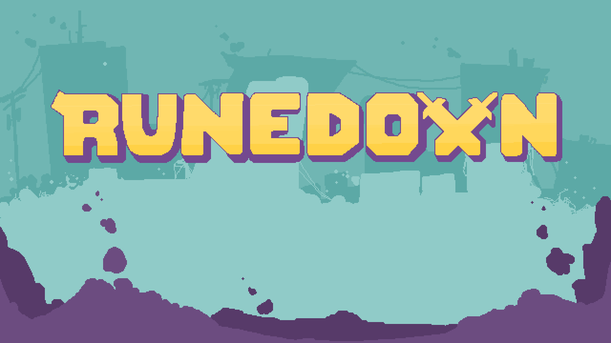
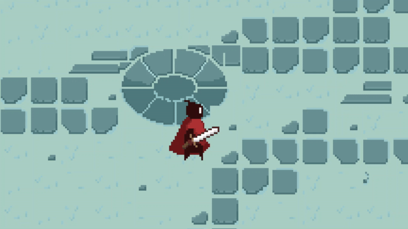
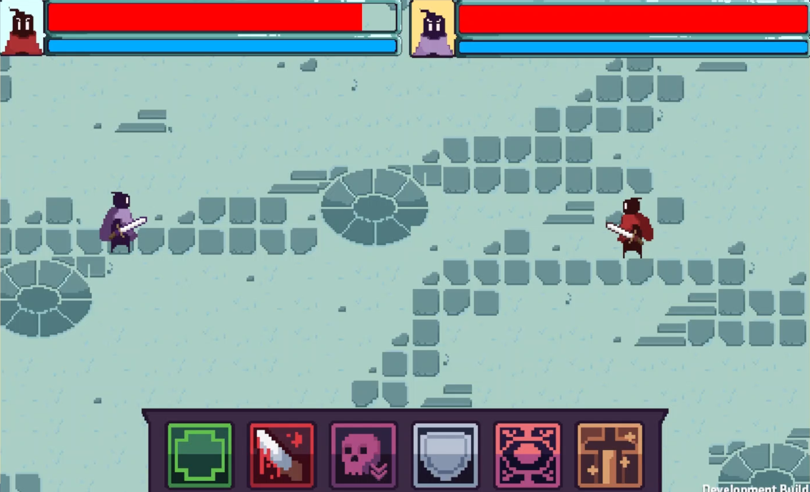

# Runedown
**Runedown: Top Down Multiplayer RPG**

---

## 🎮 Overview

Runedown is our grade 12 passion project: an indie, top‑down RPG that blends minimalist pixel art with deep, strategic dueling gameplay. On top of its beautiful retro pixel aesthetic, it consists of responsive UI, smooth animations, and complex logic—all built in Unity with Photon Networking.

---

## 🚀 Key Features

* **Dynamic Duels:** Engage in one‑on‑one battles with AI or friends via Photon networking. (AI not implemented yet)
* **Fluid Animations:** Sprite sheets bring characters and enemies to life.
  !\[Red Sprite Sheet]\(docs/red\ sprite.png) !\[Purple Sprite Sheet]\(docs/purple\ sprite.png)
* **Responsive UI:** Seamless menu transitions for login, stats, and duel initiation.
* **Interactions:** Objects, collisions, and events that trigger animations/side effects.
* **Cross-platform:** Built in Unity with C#, optimized for desktop and mobile.

---

## 📸 Gallery

**Character Animation**

**Duel Sequence**

---

🎨 Art Credits

All art created in Aseprite by @bok_laine.

---
